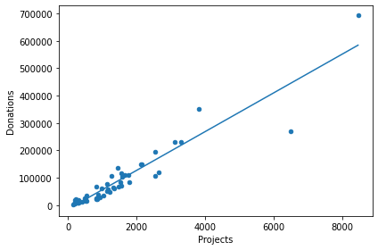
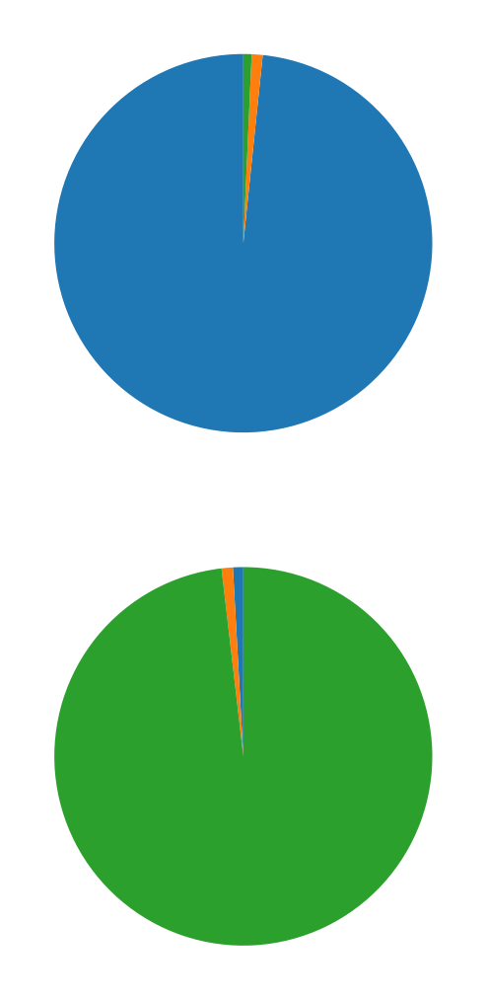

# School Donation Analysis 

Dataset of this projects are available in kaggle on below links
Link : https://www.kaggle.com/hrishikeshkini/school-donation-analysis/data

## Table of Content
  * [Problem Statement](#problem-statement)
  * [Approach](#approach)
  * [Technologies Used](#technologies-used)
  * [Installation](#installation)
  * [Bugs & Logs](#bugs--logs)
  * [Contributors](#contributors)




## Problem Statement
Which 10 states have the most number of schools that opened projects to gather donations ? Plot the data using bar plot.

What are the top 10 states in which schools gathered most amount of AVERAGE donations for their projects ?

Analyse the Maximum , minimum , mean ,meadian and 25 and 75% percentiles of Donations?

In which percent the data has points greater or smaller than the value shown in the x axis.

In which states there are more donations done by donors.

Now, it is time for a more advanced question ? Is there a relationship between the number of projects offered and number of donations made by the donors. Which states performing better in this case ? How many of them responding project requests below average and which states are performing best in terms of donations per project ? 

fit a linear model which will basically indicate the relationship between projects and donations.

How many different project types exists ? What is the total donation amount for each of them ?

How many project subject category trees exists ? Which ones attracted the most donations ?

What is the mean time that takes a project to be fully funded after posted and how it varies between states ?

Which states are the best and which are the worst performing in terms of this criteria ( mean project fully funded time) ??

## Approach
Data Exploration : I started exploring dataset using pandas,numpy,matplotlib and seaborn.

Data visualization : Ploted graphs to get insights about dependend and independed variables.

Feature Engineering : Removed missing values and created new features as per insights.

## Technologies Used
 
   1. Python 
   2. Sklearn
   3. Numpy
   4. plotly
   5. Matplotlib
   6. Pandas
   7. Seaborn

## Installation
Click here to install [python](https://www.python.org/downloads/). To install the required packages and libraries, run this pip command in the project directory after cloning the repository:
```bash
git clone https://github.com/hrishikeshkini/school_donation_analysis.git
pip install -r requirements.txt
```
If pip is not already installed, Follow this [link](https://pip.pypa.io/en/stable/installation/)

## Bugs & Logs

1. If you find a bug, kindly open an issue and it will be addressed as early as possible. [Open](https://github.com/hrishikeshkini/school_donation_analysis/issues)
2. Under localhost, logging is performed for all the actions and its stored onto logs.txt file
3. When the app is deployed on heroku, logs can be viewed on  heroku dashboard or CLI.

## Contributors
  [Hrishikesh Kini](https://github.com/hrishikeshkini)


